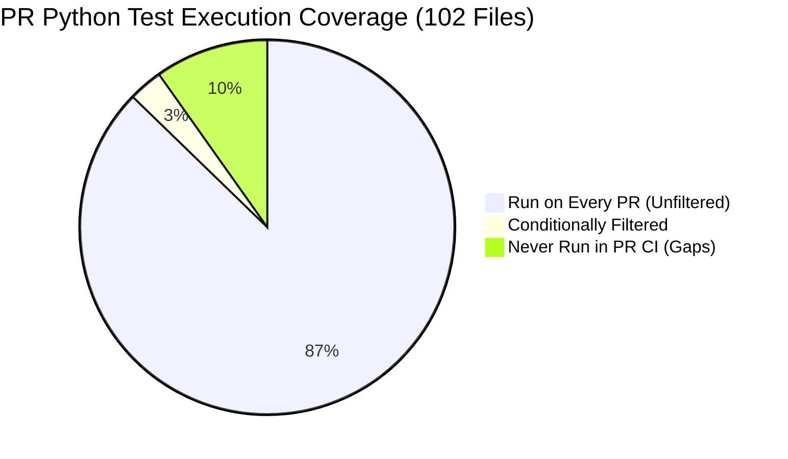
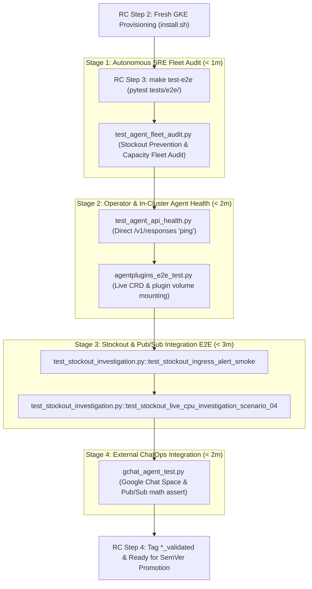

# Testing Gap Analysis & Pipeline Coverage

This document provides a systematic gap analysis of all test suites defined in the `kube-agents` codebase versus the automated CI/CD pipelines (Pull Request workflows, Release Candidate pipelines, and Prow CI). It details the operational risks of leaving critical verification suites as "manual-only" tools and defines an automated architecture to promote them into the automated Release Candidate (RC) promotion gates and PR CI.

---

## 1. Executive Summary

The repository contains over **125 test files** (including **102 Python test files**, 18 Go controller test suites, and 10 live failure scenarios) spanning unit, structural parity, live integration, and autonomous agent evaluation suites.

Key findings:
1. **The "Manual Test Trap"**: Critical end-to-end capabilities—including **Cluster Security Audits**, **Stockout Investigation Scenarios**, **Live Operator Plugin Reconciliation**, **Pub/Sub Deduplication E2E**, and **DevOps-Bench Harness Tests**—are currently configured as manual developer tools. In practice, manual tests are rarely run, leaving production releases vulnerable to silent regressions.
2. **PR Python Test Coverage Gaps**: Out of 102 Python test files, **89 run unconditionally on every PR**, **3 run conditionally** via paths-filtered workflows, and **10 are completely skipped in PR CI** before merge to `main`.
3. **Release Candidate Single-Point Fragility**: The current RC verification gate ([`rc-release-pipeline.yml`](../../.github/workflows/rc-release-pipeline.yml) via [`execute_e2e_tests.sh`](../../scripts/release/execute_e2e_tests.sh)) executes only **one** test file: [`tests/e2e/gchat_agent_test.py`](../../tests/e2e/gchat_agent_test.py). A single Google OAuth token expiration blocks releases, while in-cluster agent reasoning, operator reconciliation, and stockout plugins remain unexercised.
4. **Automated Promotion Blueprint**: All 8 unexercised test suites can and should be systematically integrated into the automated PR CI and RC Promotion pipelines.

---

## 2. Comprehensive Test Inventory vs. Pipeline Matrix

| Test Suite / Category | Location in Code | Framework & Execution | PR Pipeline (`pull_request`) | RC Pipeline (`rc-release-pipeline.yml`) | Target Automated Pipeline Home |
| :--- | :--- | :--- | :---: | :---: | :--- |
| **Admin Console Unit Tests** | `admin_console/tests/test_*.py` (13 files) | `unittest` (`make test-python`) | ✅ `python-tests.yml` | ❌ | PR CI |
| **Chat & Platform Agent Scripts** | `agents/chat/`, `agents/platform/` (~30 files) | `unittest` (`make test-python`) | ✅ `python-tests.yml` | ❌ | PR CI |
| **Docker Patches & Entrypoint Tests** | `deploy/docker/patches/` (23 files, ~620 tests) | `unittest` (`make test-python`) | ✅ `python-tests.yml` | ❌ | PR CI |
| **Repo Tooling & Parity Tests** | `scripts/test_*.py` (7 files, ~180 tests) | `unittest` (`make test-python`) | ✅ `python-tests.yml` | ❌ | PR CI |
| **Startup & Lifecycle Unit Tests** | `tests/test_*.py` (9 files, ~156 tests) | `unittest` (`make test-python`) | ✅ `python-tests.yml`<br>✅ `agent-startup-test.yml` | ❌ | PR CI |
| **Fleet Audit Ledger Unit Tests** | `agents/platform/skills/fleet-audit/scripts/test_audit_report.py` | `unittest` (`make test-python`) | ✅ `python-tests.yml` | ❌ | PR CI |
| **Tool & Chat Message Audit Tests** | `agents/chat/defaults/plugins/tool_call_audit/test_audit.py`<br>`agents/chat/defaults/hooks/chat_message_audit/test_handler.py` | `unittest` (`make test-python`) | ✅ `python-tests.yml` | ❌ | PR CI |
| **DevOps-Bench Harness Unit Tests** | `bench/tests/test_cuj.py`, `bench/tests/test_harness.py` | `pytest` (~2,500 lines) | ❌ *(GAP)* | ❌ *(GAP)* | **PR CI (`make test-python`)** |
| **Memory Provider Integration Tests** | `tests/memory/test_*.py` (4 files) | `unittest` (requires `agent.memory_provider`) | ❌ *(GAP)* | ❌ *(GAP)* | **PR CI (via test stubs)** |
| **Agent Plugin Unit Tests** | `agentplugins/*/tests/test_*.py` | `unittest` (`agentplugins-test.yml`) | ✅ *(paths-filtered)* | ❌ | **PR CI (`make test-python`)** |
| **Operator Python Unit Tests** | `k8s-operator/internal/controller/test_leader_elect.py` | `unittest` (`make -C k8s-operator test-python`) | ✅ *(paths-filtered)* | ❌ | **PR CI (`make test-python`)** |
| **Go Controller Golden Tests** | `k8s-operator/` (18 `*_test.go` files) | `go test` + `setup-envtest` | ✅ `k8s-operator-test.yml` | ❌ | PR CI |
| **Static, Parity & Schema Gates** | Manifests, IaC parity, prompt assets, links, images | `make validate`, `iac-parity-check`, `images-check`, etc. | ✅ `validate.yml`<br>✅ `docs-check.yml`<br>✅ `prettier.yml` | ❌ | PR CI |
| **Cluster Security Audit Script** | `agents/platform/skills/gke-workload-security/scripts/audit_cluster.sh` | `bash` against live cluster & GCP API | ❌ | ❌ *(GAP)* | **RC Pipeline (Stage 1)** |
| **Operator AgentPlugins Live E2E** | `tests/e2e/operator/agentplugins_e2e_test.py` | `python3` against live cluster & registry | ❌ *(GAP)* | ❌ *(GAP)* | **RC Pipeline (Stage 2)** |
| **Direct Agent API & Kanban Smoke** | Direct `/v1/responses` ping + `bench/tasks/agent-kanban-smoke` | HTTP curl + `devops-bench` | ❌ | ❌ *(GAP)* | **RC Pipeline (Stage 2)** |
| **PubSub Deduplication Live E2E** | `agentplugins/pubsub-platform/tests/dedup_e2e_test.py` | `python3` against live Pub/Sub topic | ❌ *(GAP)* | ❌ *(GAP)* | **RC Pipeline (Stage 3)** |
| **Stockout Smoke Test** | `agentplugins/gke-stockout-investigator/verify.sh` | `bash` Pub/Sub alert injection + log assert | ❌ | ❌ *(GAP)* | **RC Pipeline (Stage 3)** |
| **Stockout E2E Scenarios** | `agentplugins/gke-stockout-investigator/scenarios/` (10 scripts) | `bash` live workload wedging + RCA assert | ❌ | ❌ *(GAP)* | **RC Pipeline (Stage 3: 04 & 10)**<br>Nightly (01–09) |
| **Google Chat E2E Test** | `tests/e2e/gchat_agent_test.py` | `pytest` against live Space + Pub/Sub | ❌ *(Needs live GCP/Chat)* | ✅ **Step 3 of RC** | **RC Pipeline (Stage 4)** |

---

## 3. PR Python Test Execution Tiers & Coverage Breakdown

Across the codebase, the 102 Python test files fall into three distinct execution tiers prior to merging into `main`:



### Tier 1: Run on Every PR (Unfiltered) — 89 Test Files
Executed by `.github/workflows/python-tests.yml` (`make test-python`) regardless of which files changed in the pull request:
* `admin_console/tests/test_*.py` (13 files)
* `agents/chat/` & `agents/platform/` scripts and plugin tests (~30 files)
* `deploy/docker/patches/test_*.py` (23 files, ~620 tests)
* `scripts/test_*.py` (7 files, ~180 tests)
* `tests/test_*.py` top-level suites (8 files, ~156 tests)
* `agents/platform/skills/fleet-audit/scripts/test_audit_report.py`
* `agents/chat/defaults/plugins/tool_call_audit/test_audit.py`
* `agents/chat/defaults/hooks/chat_message_audit/test_handler.py`

### Tier 2: Conditionally Filtered (Run ONLY when specific paths change) — 3 Test Files
These test files are omitted from the root `Makefile`'s `PYTHON_TEST_DIRS` and only run if their specific path filters trigger in PR CI:
* `agentplugins/lib/tests/test_plugin_image.py` & `agentplugins/pubsub-platform/tests/test_dedup.py`:
  * Executed only by `.github/workflows/agentplugins-test.yml` when `agentplugins/**` is modified.
* `k8s-operator/internal/controller/test_leader_elect.py`:
  * Executed only by `.github/workflows/k8s-operator-test.yml` when `k8s-operator/**` or `agents/platform/scripts/**` is modified.

> **Risk**: A cross-cutting refactor, shared utility change, or dependency bump elsewhere in the repo that breaks one of these modules will **not** trigger these test jobs on a PR.

### Tier 3: Complete Gaps (NEVER run in PR CI before merge) — 10 Files (9 Suites)

| File / Suite | Type | Why It Is Skipped in PR CI | Proposed Automated Solution |
| :--- | :--- | :--- | :--- |
| `bench/tests/test_harness.py`<br>`bench/tests/test_cuj.py` | Offline Unit Tests (2,500+ lines) | Omitted from root `Makefile` `PYTHON_TEST_DIRS`. Validates response parsing, SSE streaming, and token accounting against mock HTTP servers. | Add `bench/tests/` to `PYTHON_TEST_DIRS` in `Makefile`. |
| `tests/memory/test_plugin_loads_as_a_package.py`<br>`tests/memory/test_read_only_profile.py`<br>`tests/memory/test_recall_reporting.py`<br>`tests/memory/test_user_tag_isolation.py` | Memory Provider Unit Tests | Excluded by `PYTHON_TEST_DIRS` (wildcard only matches top-level `tests/test_*.py`). Fails in host CI because `agent.memory_provider` is only inside the Hermes image. | Add mock stubs for `agent.memory_provider` so tests run cleanly in standard Python. |
| `tests/e2e/gchat_agent_test.py` | Live Chat E2E | Requires live Google Chat credentials. | Retain in automated RC Promotion Gate (Stage 4). |
| `tests/e2e/operator/agentplugins_e2e_test.py`<br>`agentplugins/pubsub-platform/tests/dedup_e2e_test.py` | Live Cluster / PubSub E2E | Maintained in code (1,600+ lines), but currently uninvoked in CI. | Integrate into automated RC Promotion Gate (Stage 2 & Stage 3). |
| `tests/installer_test_data.py` | Shared Test Fixture | Test data module imported by installer tests. | N/A (Fixture). |

---

## 4. Closing the "Manual Test Trap": Automating All 8 Gap Suites

Leaving tests as "manual verification scripts" guarantees they will eventually be neglected. Below is the technical plan to automate every unexercised suite:

### 4.1 Cluster Security Audit (`audit_cluster.sh`)
* **Why Automate in RC**: Proves in **< 2 seconds** that the fresh GKE cluster deployed by `install.sh` / Terraform meets baseline security hardening (Workload Identity, Datapath V2, Shielded Nodes).
* **How to Automate**: Execute as Stage 1 of `scripts/release/execute_e2e_tests.sh`.

### 4.2 Live Operator Plugin Reconciliation (`agentplugins_e2e_test.py`)
* **Why Automate in RC**: Proves that the compiled Kubebuilder operator reconciles `AgentPlugin` Custom Resources, fetches images from Artifact Registry, mounts plugin volumes into `platform-agent` pods, and cleanly tears down on CR deletion.
* **How to Automate**: Add to Stage 2 of `execute_e2e_tests.sh` against the live RC cluster.

### 4.3 Pub/Sub Deduplication E2E (`dedup_e2e_test.py`)
* **Why Automate in RC**: Proves that when bursts of duplicate autoscaler events hit the GCP Pub/Sub adapter, deduplication logic correctly drops duplicates, preventing duplicate PR spam.
* **How to Automate**: Add to Stage 3 of `execute_e2e_tests.sh`.

### 4.4 Stockout Alert Ingress Smoke (`verify.sh`) & Scenarios (`04-missing-zone-fallback.sh`)
* **Why Automate in RC**: Stockout investigation is a core production capability. Relying on manual testing allows prompt drift or plugin mount path bugs to reach production silently.
* **How to Automate**:
  * Run `verify.sh` to confirm Pub/Sub alert ingestion and gateway logging.
  * Run `04-missing-zone-fallback.sh --teardown --watch-timeout 240` to prove that a real wedged CPU pod triggers the full investigation loop (pod scheduling failure → autoscaler alert → agent root-cause diagnosis → GitOps PR creation) with clean teardown.
  * Run `10-false-signal.sh` to verify that false alarms cause the agent to stand down without creating junk PRs.

### 4.5 Memory Provider Unit Tests (`tests/memory/`)
* **Why Automate in PR**: Guarantees that document store packaging, scope tags, and user isolation logic cannot be broken by refactoring.
* **How to Automate**: Provide lightweight import shims for `agent.memory_provider` so `pytest tests/memory/` runs in `python-tests.yml`.

### 4.6 DevOps-Bench Harness Tests (`bench/tests/`) & Smoke Task (`agent-kanban-smoke`)
* **Why Automate in PR & RC**:
  * `bench/tests/` (unit tests): Runs in 2 seconds to guard response parsers, SSE chunking, and token scoring against mock HTTP stubs in PR CI.
  * `bench/tasks/agent-kanban-smoke`: Runs in 30 seconds in RC Stage 2 to prove agentic tool-calling and Kanban card creation on the candidate image.

---

## 5. The Golden Gate: Complete Automated RC Promotion Pipeline

The upgraded **Step 3 of `rc-release-pipeline.yml`** executes `make test-e2e` (running `pytest tests/e2e/ -v -s`), unifying all cluster, operator, stockout, and chat validations into a cohesive, multi-stage release gate:



### Modern Python E2E Layout (`tests/e2e/`):
```
tests/e2e/
├── conftest.py                       # Shared fixtures (k8s client, port-forwarding, GCP auth)
├── test_agent_fleet_audit.py         # Stage 1: Autonomous SRE Fleet Audit (Stockout & Capacity)
├── test_agent_api_health.py          # Stage 2: Direct /v1/responses REST API ping & schema check
├── test_stockout_investigation.py     # Stage 3: Pub/Sub alert ingress & live scenario RCA/GitOps PR
├── gchat_agent_test.py               # Stage 4: Real Google Chat Space & Pub/Sub math response
├── operator/agentplugins_e2e_test.py # Live CRD reconciler and plugin mount test
└── requirements.txt
```

---

## 6. Actionable Implementation Checklist

### Step 1: PR CI Updates (Zero Infrastructure Cost)
- [x] Add `bench/tests/test_*.py` to PR CI workflow ([`.github/workflows/python-tests.yml`](../../.github/workflows/python-tests.yml)) and `uv` to `requirements-test.txt`.
- [x] Add `agentplugins/*/tests/test_*.py` and `agentplugins/lib/tests/test_*.py` to `PYTHON_TEST_DIRS` in [`Makefile`](../../Makefile).
- [x] Add mock import stubs in `tests/memory/conftest.py` so `tests/memory/` passes in standard Python environments.

### Step 2: RC Promotion Pipeline Updates
- [x] Convert shell-based E2E tests into pure Python `pytest` test modules under `tests/e2e/`.
- [x] Add `test-e2e` and `test-e2e-deps` targets to root [`Makefile`](../../Makefile).
- [x] Update [`.github/workflows/rc-release-pipeline.yml`](../../.github/workflows/rc-release-pipeline.yml) to invoke `make test-e2e`.

### Step 3: Nightly Full Evaluation Matrix
- [ ] Add `.github/workflows/nightly-evaluation.yml` to run the remaining GPU/rare-VM stockout scenarios (`01-gpu-regional-scarcity.sh`, `03-large-vm-shape-scarcity.sh`, `07-hyperdisk-incompatibility.sh`) against a dedicated GPU evaluation cluster.
